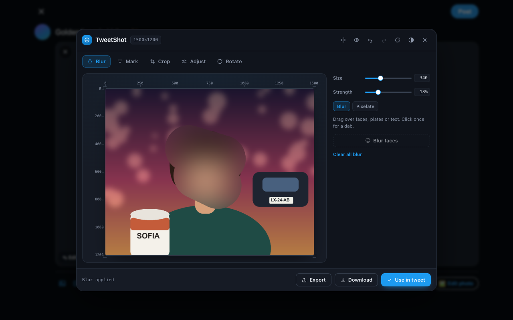
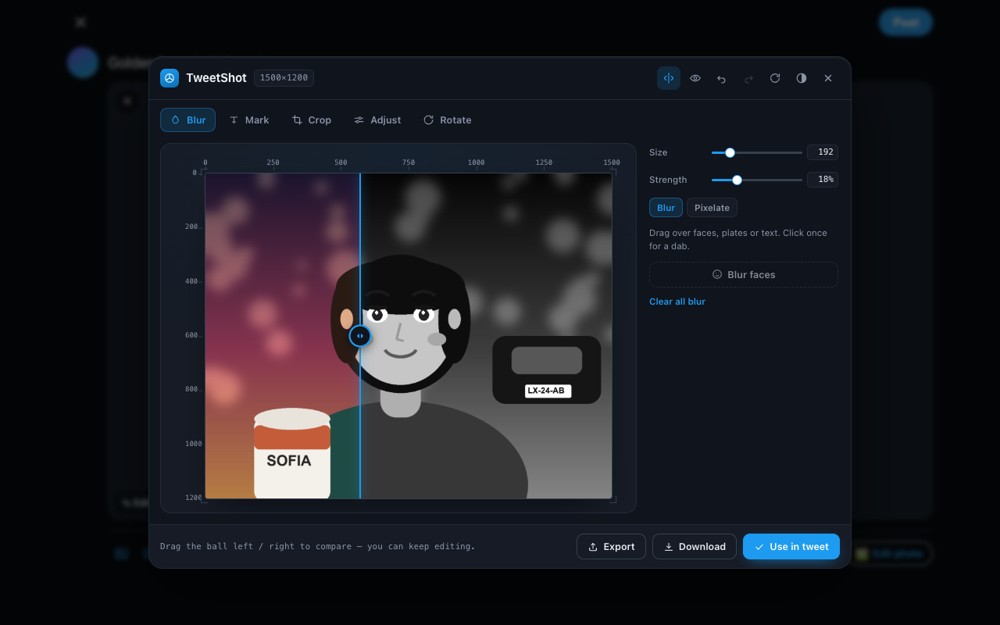
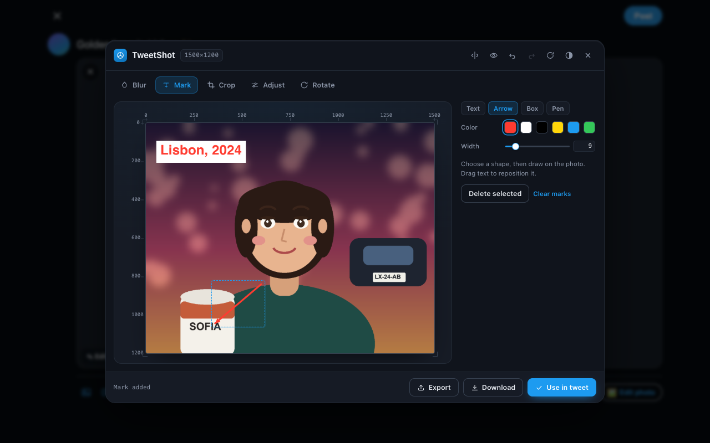
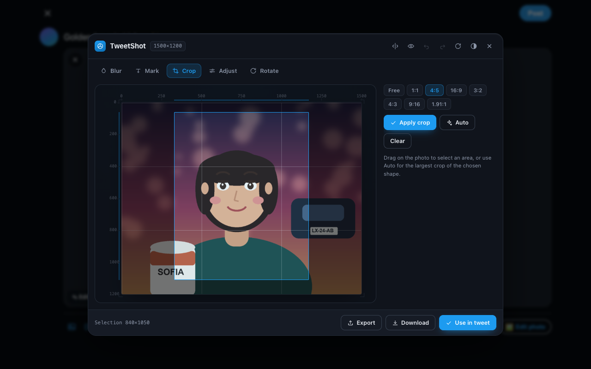
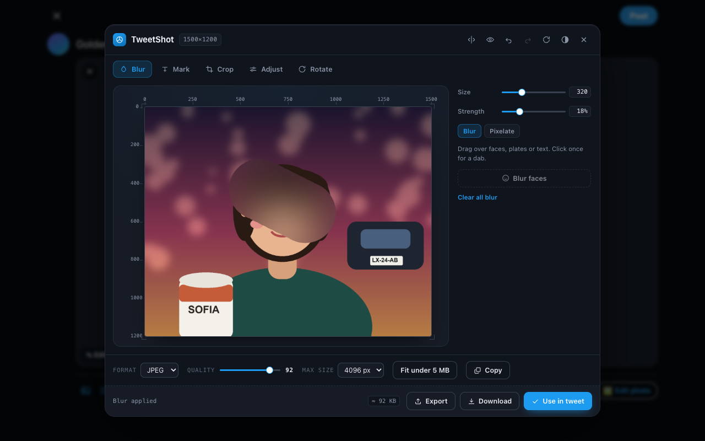
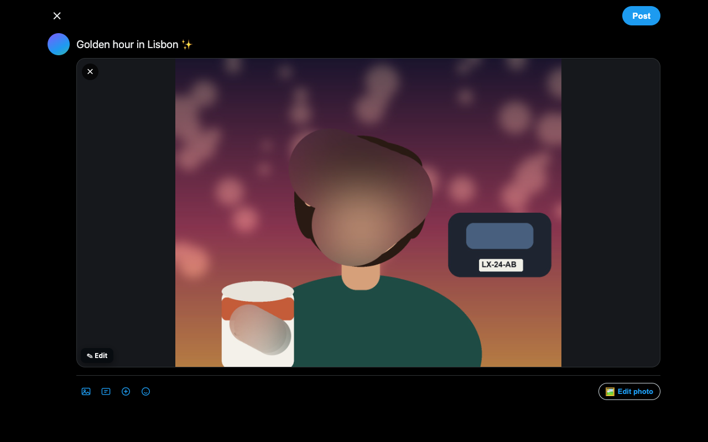

<p align="center">
  
</p>

<h1 align="center">TweetShot</h1>

<p align="center">
  <strong>An image editor that lives inside the X/Twitter composer.</strong><br>
  Blur a face, cover a plate, add a caption, crop — then post.<br>
  Everything runs on your device. Nothing is ever uploaded — no accounts, no
  analytics, no tracking, and no servers of ours.
</p>

<p align="center">
  <a href="https://github.com/thegreatLUCY/tweetshot/actions/workflows/ci.yml"></a>
  
  
  
  
  
</p>

<p align="center">
  
  <br>
  <sub>The editor opens over the composer. Blur a face, then <code>Use in tweet</code> — the edited image lands in your post.</sub>
</p>

---

## Why this exists

Posting a photo usually means leaving the site: export, open a paint app or a
"blur your photo online" website, upload your face to a stranger's server, edit,
come back, re-upload. And then the file is 6 MB and the composer rejects it.

TweetShot removes all of that. The editor is *inside* the composer, and the
image never leaves your machine.

## Everything it does

<table>
<tr>
<td width="50%" valign="top">
<p>🫧 <strong>Blur &amp; pixelate</strong><br>
A brush for faces, plates and anything else that shouldn't be readable. Size and
strength are adjustable; a single click is a single dab; fast drags interpolate
instead of leaving dots.</p>

<p>🙈 <strong>Blur faces</strong><br>
One-tap detection where the browser supports <code>FaceDetector</code>. Where it
doesn't, the button tells you so and points at the brush — no dead controls.</p>

<p>✍️ <strong>Captions &amp; marks</strong><br>
Text with an optional background chip, arrows, outline or filled boxes, and
freehand drawing. Grab any mark to move it, <code>Delete selected</code> to remove
it, with a dashed outline showing what's selected.</p>
</td>

<td width="50%" valign="top">
<p>✂️ <strong>Crop &amp; straighten</strong><br>
Free drag plus <code>1:1</code>, <code>4:5</code>, <code>16:9</code>,
<code>3:2</code>, <code>4:3</code>, <code>9:16</code> and <code>1.91:1</code>.
<em>Auto</em> picks the largest crop of the shape you chose; <em>Fit corners</em>
trims the empty wedges straightening leaves behind.</p>

<p>🎚️ <strong>Adjust</strong><br>
Brightness, contrast, saturation, grayscale, sepia and hue, with presets. Save a
look as a <strong>recipe</strong> and reuse it on the next photo.</p>

<p>↔️ <strong>Compare</strong><br>
Drag the divider for a real before/after — the original side ignores your
filters, so the two actually differ — or view them side by side.</p>

<p>📏 <strong>Never too big</strong><br>
A live export size estimate and one-click <strong>fit under 5 MB</strong>, so a
photo is never rejected for being too large.</p>
</td>
</tr>
</table>

**Workflow extras:** multi-image batches that inject together · right-click any
image → *Edit this image with TweetShot* · paste or drag an image straight in ·
undo/redo on every edit · an unfinished edit in the full-page editor survives a
reload · light and dark themes · keyboard shortcuts throughout.

## Screenshots

<table>
  <tr>
    <td width="50%"><br><sub><b>Drag to compare</b> — before/after, live, while you keep editing</sub></td>
    <td width="50%"><br><sub><b>Captions, arrows and boxes</b> — drag any mark to reposition</sub></td>
  </tr>
  <tr>
    <td width="50%"><br><sub><b>Crop for X</b> — presets, guides and Auto</sub></td>
    <td width="50%"><br><sub><b>Live size estimate</b> — and one-click fit under 5 MB</sub></td>
  </tr>
</table>

<p align="center">
  
  <br>
  <sub>…and the result lands directly in the composer.</sub>
</p>

## Design

The editor is built as a **calibration plate** rather than a generic toolbar: the
photo sits on a darkroom backdrop with print registration marks and live pixel
rulers, and those rulers highlight your crop and blur selection in real time.

- **Type** — Archivo for equipment-style labels, IBM Plex Sans for the interface,
  IBM Plex Mono for every number (dimensions, slider values, ruler ticks).
- **Color** — a deep blue-black darkroom dark with X-blue as the single functional
  accent; a "paperproof" light theme mirrors it and follows `prefers-color-scheme`.
- **Fonts are bundled locally** (~100 KB, both families SIL OFL) and registered
  with the FontFace API, so the UI needs no remote fonts and stays immune to the
  host page's CSP.

---

## Install

**From source (today)** — the extension isn't on the Chrome Web Store yet:

```bash
git clone https://github.com/thegreatLUCY/tweetshot.git
```

1. Open `chrome://extensions` and enable **Developer mode**
2. **Load unpacked** → select the cloned folder
3. Go to `https://x.com/compose/post`, attach a photo, click **✎ Edit**
4. Edit → **Use in tweet**

Reload the extension *and hard-refresh the X tab* after pulling changes, so the
content script is re-injected.

**Firefox** — MV3 differs (event pages instead of a service worker):

```bash
cp manifest.firefox.json manifest.json   # in a copy of the folder
```

Then `about:debugging#/runtime/this-firefox` → **Load Temporary Add-on**. The
Firefox manifest is provided but has **not been verified in a real Firefox
build** — treat it as a starting point.

## Privacy

**Nothing is ever uploaded.** No accounts, no analytics, no tracking, no ads, and
no servers of ours — every edit happens on your device with the browser's
`<canvas>` API, and the fonts are bundled inside the extension.

The one piece of network activity that can happen is your browser *re-reading an
image you explicitly asked to edit* — a right-clicked image, or one handed in via
`?src=`. That reads from the site you are already on and sends nothing anywhere.
Saving re-encodes the image, which strips EXIF metadata — including GPS.

It runs on `x.com` and `twitter.com` and nowhere else.

📄 [Full privacy policy](https://thegreatlucy.github.io/tweetshot/privacy.html) ·
🌐 [Landing page](https://thegreatlucy.github.io/tweetshot/)

## Development

```bash
npm test              # unit tests: geometry, crop, transforms, marks, fitting
npm run lint          # syntax-check every script
npm run test:browser  # end-to-end: boots a fake composer, drives every entry point
npm run preflight     # Chrome Web Store blockers (manifest, icons, remote code)
npm run build         # -> dist/tweetshot-<version>.zip
npm run test:artifact # build, then run the browser suite against the packaged zip
npm run shots         # regenerate store screenshots at 1280x800
```

No dependencies. The engine, the UI and all the tooling are dependency-free, so
`npm install` does nothing on purpose.

### The browser harness matters

`npm run test:browser` is not a nicety. A single undefined reference in
`content/content.js` makes the whole editor fail *silently* on the live site, and
unit tests cannot see it. The harness serves a fake composer, injects the real
scripts and drives every way in — the toolbar picker, the composer's own file
input, the ✎ Edit badge, multi-image batches, and a simulated invalidated
extension context — then asserts the editor opens and that **Use in tweet**
actually attaches rather than downloading.

There's a second harness page, `composer-portal.html`, where the media input is
hoisted outside the composer. That is how X really behaves, and it is the
regression guard for the bug that made saving download instead of attach.

### Project layout

```
manifest.json               Chrome / Edge
manifest.firefox.json       Firefox variant
background.js               service worker: context menu, opens the editor
lib/editor-core.js          canvas engine (pure, unit-tested)
lib/editor-ui.js            editor card: tools, pointer, undo, recipes, export
lib/editor-ui.css           darkroom + paperproof themes
content/content.js          X.com detection, batching, injection
editor/editor.html|css|js   full-page editor (shell + resume + ?src=)
popup/                      toolbar popup
_locales/en/messages.json   UI strings (chrome.i18n)
fonts/                      bundled Archivo / IBM Plex + their OFL licence
test/core.test.js           unit tests
test/harness/               browser harness + test fixtures
scripts/                    preflight, build, artifact test, screenshots, icons
.github/workflows/ci.yml    lint + unit tests + preflight on every push
docs/                       GitHub Pages site (landing + privacy policy)
store/                      submitted screenshots and promo tiles
```

<details>
<summary><b>How the injection works</b></summary>

- The content script watches `input[data-testid="fileInput"]` and composer previews.
- File selection is intercepted in the **capture phase**, before X's React
  handler, so X never uploads the untouched original.
- On save, the edited canvas becomes a `File` and is pushed into the composer's
  media input, dispatching `input` + `change`. X often **hoists that input outside
  the composer subtree**, so the lookup falls back from composer-scoped → known
  testid → any image input, and verifies an actual preview appeared before
  claiming success.
- If no input can be reached it dispatches a synthetic **paste** (X accepts pasted
  images), and finally copies to the clipboard. **It never silently downloads.**
- Editing an already-attached image removes the matching preview afterwards,
  found relative to that image rather than by a global selector.

If X changes its DOM (`data-testid` values), update `FILE_SEL` / `composerScope`
in `content/content.js`.

</details>

<details>
<summary><b>Releasing</b></summary>

```bash
npm run lint && npm test   # code health
npm run preflight          # store blockers
npm run test:artifact      # proves the packaged build works
npm run build              # dist/tweetshot-<version>.zip  -> upload this
```

Bump the version in `manifest.json`, `manifest.firefox.json` and `package.json`
before each upload — the store rejects a version it has already seen.

Store copy (name, descriptions, permission justifications, data-usage answers,
reviewer test steps) lives in **[STORE_LISTING.md](STORE_LISTING.md)**; the
privacy policy to host is in **[docs/privacy.html](docs/privacy.html)**.

</details>

## Roadmap

- Face auto-blur that works on desktop Chrome, via a small bundled model
- Text and shape alignment guides
- Background removal
- Trim presets for video stills

## Licence

No licence has been chosen yet, so the code is **all rights reserved** by
default. The bundled **Archivo** and **IBM Plex** fonts are licensed separately
under the SIL Open Font License — see [`fonts/LICENSE.txt`](fonts/LICENSE.txt).

---

<p align="center">
  <sub>TweetShot is an independent project and is not affiliated with X Corp.</sub>
</p>
